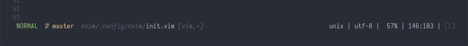
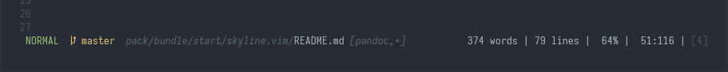
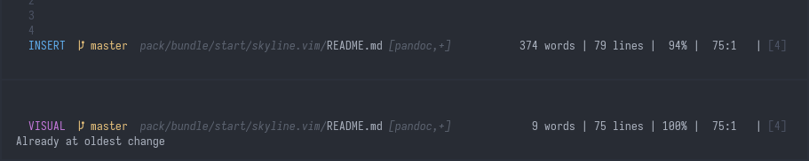
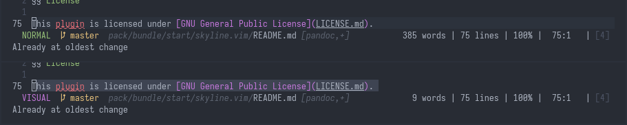

# skyline.vim

skyline.vim is a simple statusline plugin for Vim.

It is a much slimmer alternatives to plugins like [powerline](https://github.com/powerline/powerline), [vim-airline](https://github.com/vim-airline/vim-airline), or [lightline.vim](https://github.com/itchyny/lightline.vim). But, of course, it is not as feature-packed. That being said, if you are looking for a minimal, functional statusline that expands upon and is easier to configure than the default `:h statusline`, look no further.

The notable features of `skyline.vim` are:

* a dynamic mode module, whose color changes to indicate your editing mode
* a git branch module, supported by [vim-fugitive](https://github.com/tpope/vim-fugitive) or plugin-less
* word and line count modules, perfect Vimmers that are writers
* show and hide many modules at will with simple `g:skyline*` variables

## Installation

### [vim-plug](https://github.com/junegunn/vim-plug)

1. Add to your `.vimrc` or `init.vim`

```
Plug 'ourigen/skyline.vim'
```

2. Install with `:PlugInstall`

### [Native `:packadd`](https://vimhelp.org/repeat.txt.html#packages)

```sh
# NOTE: You can replace `bundle` with any directory name

# Vim instructions
mkdir -p ~/.vim/pack/bundle/start
cd ~/.vim/pack/bundle/start
git clone https://github.com/ourigen/skyline.vim
# generating helptags for `:h skyline.txt`
vim -u NONE -c "helptags skyline.vim/doc" -c q

# Neovim instructions
mkdir -p  ~/.config/nvim/pack/bundle/start
cd ~/.config/nvim/pack/bundle/start
git clone https://github.com/ourigen/skyline.vim
# generating helptags for `:h skyline.txt`
nvim -u NONE -c "helptags skyline.vim/doc" -c q
```

## Options

* `g:skyline_ale` Set `let g:skyline_ale = 1` to show linter errors and warnings. Depends on
	[ALE](https://github.com/dense-analysis/ale). Defaults to 0.

* `g:skyline_fugitive` Set `let g:skyline_fugitive = 1` to show the branch of your file. Depends on [vim-fugitive](https://github.com/tpope/vim-fugitive). Defaults to 0.

* `g:skyline_path` Set `let g:skyline_path = 0` if you only want the tail (file name) of the path. Defaults to 1 for full relative path.

* `g:skyline_fileformat` Set `let g:skyline_fileformat = 0` to hide the file format. Defaults to 1.

* `g:skyline_encoding`  Set `let g:skyline_encoding = 0` to hide the file encoding. Defaults to 1.

* `g:skyline_wordcount` Set `let g:skyline_wordcount = 1` to show the total word count of the file / visual selection. Defaults to 0.

* `g:skyline_linecount` Set `let g:skyline_linecount = 1` to show the total line count of the file. Defaults to 0.

* `g:skyline_percent` Set `let g:skyline_percent = 0` to hide the percentage through file. Defaults to 1.

* `g:skyline_lineinfo` Set `let g:skyline_lineinfo = 0` to hide the line : column position. Defaults to 1.

* `g:skyline_filetype` Set `let g:skyline_filetype = 0` to hide filetype. Defaults to 1.

* `g:skyline_bufnum` Set `let g:skyline_bufnum = 0` to hide buffer number. Defaults to 1.

## Screenshots

### Standard Statusline


### "Writer" Statusline


### Dynamic Mode Module


### Dynamic Word Count Module


## News and Notes

* For more information, refer to the [skyline.vim documentation](doc/skyline.txt).
* This plugin is licensed under [GNU General Public License](LICENSE.md).
* **NEW**: A `dev` branch was created to test out redesigns and integrations.
Notable changes are [ALE](https://github.com/dense-analysis/ale) integration for linter information,
removal of plugin-less git branch parsing, removal of `g:skyline_preview`,
and changing delimiter from `|` to ` `. To try out the `dev`, use

```vim
Plug 'ourigen/skyline.vim', { 'branch': 'dev' }
```
